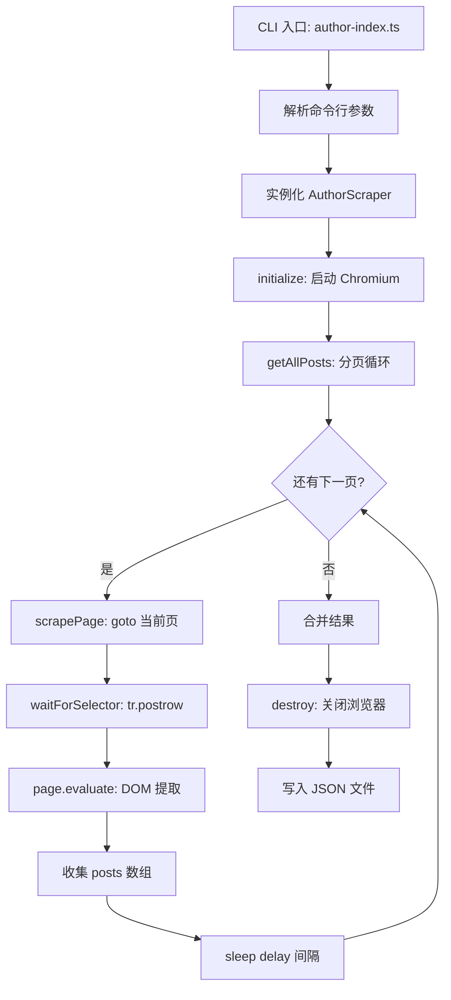

## 用户需求

新增一个独立的爬取功能，根据帖子ID（tid）和用户ID（authorid），爬取指定用户在指定帖子中的所有发言内容。

## 核心功能

- 按 URL 模板 `https://bbs.nga.cn/read.php?tid={tid}&authorid={authorid}&page={page}` 逐页爬取
- 从 DOM 元素 `span.postcontent.ubbcode` 中提取帖子正文内容（保留 innerHTML 格式）
- 从 `a[name="l{floor}"]` 提取楼层号，从 `span.postinfot.postdatec.stxt` 提取发帖时间
- 自动翻页直到末页（当页帖子行数不足20条时判为末页）或达到 --max-pages 上限
- 支持 --no-headless 可视化模式、--delay 翻页间隔、--output 自定义输出路径
- 结果输出为 JSON 文件，包含 tid、authorid、posts 数组（每条含 floor/date/content）、totalPages、totalPosts、scrapedAt
- 在 package.json 新增 `"scrape:author"` 脚本命令
- 完全独立的全新文件，不修改现有 src/index.ts、src/scraper.ts、src/types.ts、src/utils.ts

## 技术方案

### 技术栈

- **运行时**: Node.js >= 22 + TypeScript + tsx
- **浏览器自动化**: Playwright (chromium)
- **模块系统**: NodeNext (ESM)

### 实现策略

参照现有 `src/scraper.ts` 的架构模式，创建独立的 `AuthorScraper` 类和 CLI 入口，复用相同的 browser 生命周期模式和翻页逻辑，但专注于提取楼层号、日期、正文内容。

### 架构设计



### 目录结构

```
playwright-demo/
├── package.json                          # [MODIFY] 新增 "scrape:author" 脚本
└── src/
    ├── author-scraper.ts                 # [NEW] AuthorScraper 类，浏览器管理和 DOM 提取
    └── author-index.ts                   # [NEW] CLI 入口，参数解析和流程编排
```

**不修改的文件**: src/index.ts, src/scraper.ts, src/types.ts, src/utils.ts

### 关键数据结构

```typescript
// 单条发言
interface AuthorPost {
  floor: number;      // 楼层号
  date: string;       // 发帖时间 "2026-05-14 12:25"
  content: string;    // 正文内容 (innerHTML)
}

// 爬取结果
interface AuthorScrapeResult {
  tid: number;
  authorid: number;
  posts: AuthorPost[];
  totalPages: number;
  totalPosts: number;
  scrapedAt: string;
}

// 爬取配置
interface AuthorScrapeConfig {
  tid: number;
  authorid: number;
  headless?: boolean;
  pageDelay?: number;
  maxPages?: number;
  outputFile?: string;
}
```

### 实现要点

#### DOM 提取规则（基于 post-dom.html 验证）

- **楼层号**: 查找 `a[name]` 元素，name 属性格式为 `l{数字}`，截取 "l" 后的数字
- **发帖时间**: 选择器 `span.postinfot.postdatec.stxt`，取 textContent 去首尾空白
- **正文内容**: 选择器 `span.postcontent.ubbcode`，取 innerHTML（保留 `<br>` 等格式标签），同时 trim 去除首尾空白
- **每层容器**: `tr.postrow`，统计其数量判断是否末页

#### 翻页结束条件

- 当页 `tr.postrow` 数量 < 20 时判定到达末页
- 或 page >= maxPages 时强制停止

#### 性能与可靠性

- 复用现有项目的 sleep 延迟模式（默认 2000ms），避免触发反爬
- 翻页前 waitForSelector 等待 `tr.postrow` 出现（超时 15s）
- goto 失败时 catch 并返回空结果，不中断整体流程
- 复用 chromium.launch 的无头/非无头模式切换逻辑

### 命令行用法

```
tsx src/author-index.ts --tid 45974302 --authorid 150058
tsx src/author-index.ts --tid 45974302 --authorid 150058 --no-headless --delay 3000
tsx src/author-index.ts --tid 45974302 --authorid 150058 --output ./output/author-posts.json --max-pages 50
```