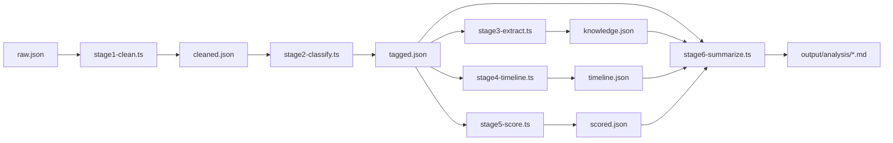

## 用户需求

对 NGA 社区股票讨论帖数据进行全流程处理，原始数据为 `output/author_tid_45974302_authorid_150058_2026-06-25_11-41-20.json`，包含 3428 条发言，覆盖 2026-01-12 至 2026-06-25 共 173 页。

## 核心功能

- **噪音清洗**：过滤纯吹水、短互动、表情回复等无意义发言，保留约 2200-2500 条有价值内容
- **多维分类标注**：对每条发言按主题类型、涉及板块、技术深度三维度打标签
- **技术知识抽取**：从发言中提取波浪理论标记、关键点位、交易规则、板块轮动规律
- **时间线演化分析**：按周/月聚合，追踪指数预判准确度、板块态度演变、仓位变化、宏观叙事切换
- **质量加权评估**：综合信息密度、原创性、可操作性、验证性打分，产出 Top 200 精选
- **分层总结输出**：生成一句话日报、周度简报 Markdown、总纲长文报告三级摘要

## 输出物

所有分析结果输出至 `output/analysis/` 目录，包括各阶段中间数据 JSON 和最终摘要 Markdown 文件。

## 技术选型

| 项目 | 选择 | 理由 |
| --- | --- | --- |
| 语言 | TypeScript | 与现有项目一致，类型安全 |
| 运行时 | tsx | 已在 package.json 中配置，无需编译直接执行 |
| 模块系统 | ES Module (NodeNext) | 与 tsconfig.json 配置一致 |
| 数据处理 | 纯规则引擎 + 统计 | 不依赖外部 LLM API，保证离线可运行 |
| 输出格式 | JSON + Markdown | JSON 供程序消费，Markdown 供人工阅读 |


## 实现方案

### 整体架构：管道模式

采用线性管道架构，每个阶段独立可执行，中间结果落盘为 JSON，下一阶段读取上一阶段产物。这样设计的好处是：

- 每个阶段可独立调试和迭代
- 中间产物可人工检查质量
- 重跑某阶段时无需从头开始



### 模块划分

| 模块 | 文件 | 职责 |
| --- | --- | --- |
| 类型定义 | `src/analyzer/types.ts` | 所有共享接口和类型 |
| 管道编排 | `src/analyzer/pipeline.ts` | 串联六阶段，顺序执行 |
| 阶段一 | `src/analyzer/clean.ts` | 噪音过滤 + 去重 |
| 阶段二 | `src/analyzer/classify.ts` | 多维标签打标 |
| 阶段三 | `src/analyzer/extract.ts` | 知识模式抽取 |
| 阶段四 | `src/analyzer/timeline.ts` | 时序聚合分析 |
| 阶段五 | `src/analyzer/score.ts` | 质量加权评分 |
| 阶段六 | `src/analyzer/summarize.ts` | 多级摘要生成 |
| 工具函数 | `src/analyzer/utils.ts` | 日期解析、文本统计等 |


### 数据流

1. `pipeline.ts` 读取 `output/author_tid_*.json` 原始数据
2. 依次调用各阶段函数，传入上游数据，产出下游数据
3. 每个阶段将结果写入 `output/analysis/` 对应 JSON 文件
4. 最终阶段读取前几个阶段的产物，生成 Markdown 摘要

### 关键性能考量

- 3428 条数据量很小，全量内存处理，无需分批
- 分类阶段用预编译正则 + Map 查表，O(n) 复杂度
- 时间线分析按日期 `groupBy`，使用 `Map<string, Post[]>` 聚合

## 实现细节

### 阶段一：噪音清洗规则

```
过滤条件 (满足任一即过滤):
1. content.length < 15 && !containsDigit(content) && !containsSectorKeyword(content)
2. content 匹配纯互动模式: /^(哈哈|懂了|nb|牛|好|收到|感谢|支持|mark|学习|收藏|插眼).{0,12}$/
3. type==="reply" && content 只有表情标签 (如 "[哭笑]""[呆]") 且 content.length < 20
4. content 与上一条相似度 > 85% (Jaccard 或字符级)
```

### 阶段二：分类关键词映射

**主题类型**：

- `指数预判`: 匹配 /点位|压力|支撑|颈线|突破|破位|站稳|加速|回踩|反抽|反弹|回调/
- `板块分析`: 匹配板块关键词（见下）
- `宏观联动`: 匹配 /美元|美债|黄金|原油|石油|加息|降息|美联储|通胀|地缘|战争/
- `资金分析`: 匹配 /量能|缩量|放量|两融|北向|机构|游资|量化|踏空|获利盘|卖盘/
- `交易策略`: 匹配 /做T|仓位|止盈|止损|减仓|加仓|满仓|空仓|轮动|躺死|打野/
- `心态管理`: 匹配 /别急|不要|焦虑|怕什么|心态|贪|情绪|耐心/

**涉及板块**（13个标签，多选）：

- 半导体、商业航天、AI应用、AI硬件/CPO、AIDC/算力、新能源/电池、稀土、有色、化工、石油天然气、金融/券商、机器人、医药

**技术深度**：

- deep: content.length >= 100 且含因果推理关键词（因为/所以/如果/导致/意味着/本质上）
- medium: content.length >= 30 且含至少两个维度指标
- shallow: 其余

### 阶段三：知识抽取模式

- **波浪标记**: 正则 `/3-[1-5]\b/g` 提取所有波浪阶段引用，按时间排序
- **关键点位**: 正则 `/\b(4\d{3}(?:-\d{4})?)\b/g` 提取所有指数点位，去重建库
- **交易规则**: 正则匹配 "如果...就...""当...时...就...""...的话就..." 模式
- **板块轮动**: 统计相邻发言中板块 A 和板块 B 共现频率，构建转移矩阵

### 阶段四：时间线聚合

- 按 ISO 周聚合（`getISOWeek`），每周统计：各板块提及次数、看多/看空信号比、仓位中位数
- 按日聚合发言数，绘制活跃度曲线
- 关键转折点识别：当某日发言量超过 7 日均线的 2 倍时标记

### 阶段五：评分模型

```
总分 = 信息密度×0.30 + 原创性×0.25 + 可操作性×0.25 + 验证性×0.20

信息密度: 含具体数值 +10, 含因果推理 +10, 含多因素联动 +10 (满分30)
原创性:   首次出现主题 +15, 独特表述 +10 (满分25)
可操作性: 明确买卖指令 +15, 含仓位建议 +10 (满分25)
验证性:   后续有证实引用 +20 (满分20，需阶段四回溯)
```

### 阶段六：摘要模板

- **L1 日报**：`${date} | ${核心主题} | ${关键操作} | ${指数判断}` 一行
- **L2 周报**：Markdown 模版含本周指数区间、板块轮动图、仓位建议、Top 5 高质量发言摘录
- **L3 总纲**：Markdown 长文含交易体系总结、板块轮动全景、关键判断回顾、统计数据附录

## 使用的 Agent 扩展

### SubAgent

- **code-explorer**
- 用途：在项目初始化阶段探索现有代码结构，确认无冲突后开始创建新文件
- 预期结果：确认 `src/` 目录下现有文件结构，确保新创建的 `src/analyzer/` 目录不与现有代码冲突