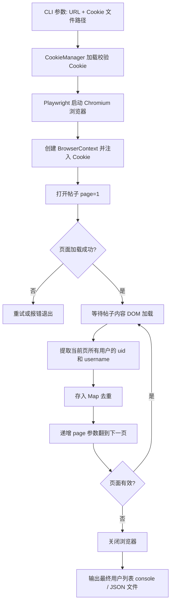

## 产品概述

一个基于 Playwright + TypeScript 的命令行爬虫工具，用于爬取 NGA 论坛帖子中所有发言用户的 ID 和用户名，支持跨页爬取和结果去重。

## 核心功能

1. **Cookie 认证**：支持从 JSON 文件加载浏览器 Cookie，以绕过 NGA 的登录访问限制
2. **多页爬取**：从第 1 页到最后一页自动翻页，爬取所有楼层的用户信息
3. **用户信息提取**：从页面 DOM 中提取每个发言用户的 ID 和用户名
4. **跨页去重**：同一用户在多个楼层出现时，最终输出只保留一条记录
5. **结果导出**：支持控制台打印和 JSON 文件两种输出方式

## 技术栈选型

- **运行时**: Node.js 18+
- **语言**: TypeScript 5.x
- **浏览器自动化**: Playwright 1.49+
- **模块加载**: tsx（直接运行 TS 文件，无需编译步骤）

## 实现方案

### 总体策略

使用 Playwright 模拟已登录用户的浏览器环境。由于 NGA 帖子需要登录才能访问（实际验证结果：无论是 HTML 页面还是 `__output=8/11` API 接口，均返回错误码 15 "访客不能直接访问"），本工具通过**注入 Cookie** 实现认证。同类工具（如 ngapost2md）也采用相同策略——用户手动从浏览器导出 Cookie 提供给爬虫。

### 关键设计决策

1. **Cookie 注入**：使用 Playwright 的 `browserContext.addCookies()` 方法注入 JSON 格式 Cookie，完全模拟浏览器登录态。Cookie 来自用户从已登录浏览器中导出
2. **DOM 选择器可配置**：NGA 存在标准版和触屏版等多种版式，DOM 结构不同。将 CSS 选择器设计为可配置参数，并提供基于常见 NGA 版式的默认值
3. **翻页策略**：通过 URL 参数 `&page=N` 直接导航翻页（比点击"下一页"按钮更稳定可靠），从 page=1 开始递增，直到页面返回非预期内容或出现错误
4. **去重机制**：使用 `Map<uid, username>` 数据结构，按用户 ID 去重，后出现的用户名覆盖先出现的
5. **健壮性处理**：页面加载超时重试机制、翻页间随机延迟（1-3 秒）降低反爬风险、每个页面等待关键元素出现后才提取

### 预期性能

- 单页爬取：约 2-5 秒
- 内存占用：极低（仅存储 uid + username）
- 翻页总时间：页数 x (2-5 秒) + 页间延迟

## 架构设计

### 系统架构

```
四层架构:
- CLI 层 (index.ts)     : 命令行参数解析、流程编排、用户交互
- 应用层 (scraper.ts)   : 爬取核心逻辑、DOM 解析、翻页控制
- 服务层 (cookie-manager.ts): Cookie 文件加载、校验、格式转换
- 工具层 (utils.ts)     : 结果去重、格式化输出、文件保存
```

### 数据流



## 目录结构

```
playwright-demo/
├── package.json             # [NEW] 项目配置, 依赖: playwright, tsx, typescript
├── tsconfig.json            # [NEW] TypeScript 编译配置, 目标 ES2022
├── .gitignore               # [NEW] 排除 node_modules, cookies/, output/
├── src/
│   ├── index.ts             # [NEW] CLI 入口, 使用 process.argv 解析参数, 协调爬取流程
│   ├── scraper.ts           # [NEW] NgaScraper 类, 核心爬虫: 浏览器管理/DOM 提取/翻页控制
│   ├── types.ts             # [NEW] 类型定义: UserInfo, ScrapeConfig, ScrapeResult 等
│   ├── cookie-manager.ts    # [NEW] Cookie 文件加载、校验、格式转换为 Playwright 格式
│   └── utils.ts             # [NEW] 结果去重、格式化打印、JSON 文件导出
└── README.md                # [NEW] 使用说明文档（含获取 Cookie 的详细步骤）
```

## 关键代码结构

### 核心类型定义 (src/types.ts)

```typescript
/** 用户信息 */
export interface UserInfo {
  uid: number;
  username: string;
}

/** 爬虫配置 */
export interface ScrapeConfig {
  targetUrl: string;         // 帖子完整 URL
  tid: number;               // 帖子 ID (从 URL 解析)
  cookieFilePath?: string;   // Cookie JSON 文件路径
  headless: boolean;         // 是否无头模式
  pageDelay: number;         // 翻页间隔(ms)
  usernameSelector: string;  // 用户名的 CSS 选择器
  postSelector: string;      // 每个楼层的容器选择器
  uidAttribute: string;      // 包含 uid 的属性名 (如 data-uid)
}

/** 爬取结果 */
export interface ScrapeResult {
  tid: number;
  targetUrl: string;
  totalPages: number;
  users: UserInfo[];
  totalPosts: number;        // 去重前总楼层数
  scrapedAt: string;
}
```

### 爬虫核心接口 (src/scraper.ts)

```typescript
class NgaScraper {
  constructor(config: ScrapeConfig);
  async initialize(): Promise<void>;          // 启动浏览器 + 注入 Cookie
  async scrapeAllPages(): Promise<UserInfo[]>; // 遍历所有页面
  async scrapeSinglePage(page: number): Promise<UserInfo[]>; // 提取单页用户
  async destroy(): Promise<void>;             // 关闭浏览器资源
}
```

## Agent Extensions

### Skill: playwright-cli

- **目的**: 使用 playwright-cli skill 指导 Playwright 爬虫的实现，包括浏览器启动、Cookie 注入、页面导航、元素等待、DOM 提取等核心功能的正确实现
- **预期产出**: 健壮可靠的爬虫代码，正确处理认证、翻页和元素提取

### SubAgent: code-explorer

- **目的**: 在实现过程中探索项目结构，验证文件创建和代码组织的正确性
- **预期产出**: 确保项目文件结构和依赖配置正确