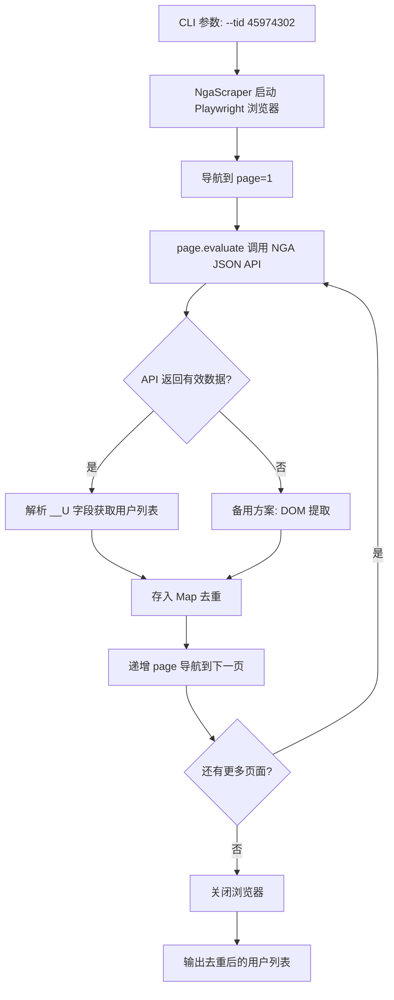

## 产品概述

一个基于 Playwright + TypeScript 的命令行工具，用于爬取 NGA 论坛帖子中所有楼层发言用户的 ID 和昵称，支持自动翻页遍历所有页面，并对跨页出现的同一用户去重输出。

## 核心功能

1. **模拟浏览器直接访问**：Playwright 启动 Chromium 浏览器打开帖子页面，利用真实浏览器环境获取内容（无需 Cookie）
2. **全页自动翻页**：从第 1 页到最后一页，自动遍历所有楼层
3. **用户信息提取**：获取每个发言用户的 uid（数字 ID）和 username（昵称）
4. **跨页去重**：同一用户在不同页面的多个楼层发言，输出时只保留一条记录
5. **结果导出**：支持控制台打印表格和 JSON 文件两种输出方式

## 技术栈选型

- **运行时**: Node.js 18+
- **语言**: TypeScript 5.x
- **浏览器自动化**: Playwright 1.49+（启动真实 Chromium 浏览器）
- **模块加载**: tsx（直接运行 TS 文件，无需编译步骤）

## 实现方案

### 总体策略

使用 Playwright 启动真实 Chromium 浏览器，导航到 NGA 帖子页面。采用**双模提取策略**：

1. **主方案（NGA JSON API）**：页面加载后，通过 `page.evaluate()` 在浏览器上下文中调用同源 API `/read.php?tid=X&page=Y&__output=11`，获取 JSON 响应并提取 `__U` 字段（包含该页所有用户的 uid→username 映射）。此方式返回结构化数据，比 DOM 解析更稳定可靠。
2. **备用方案（DOM 提取）**：若 API 方式失败，回退到从页面 DOM 元素中提取用户信息。

### 关键设计决策

1. **翻页策略**：通过 `page.goto()` 直接导航 `&page=N` 参数翻页（比点击"下一页"按钮更稳定），从 page=1 开始递增，直到页面返回空内容（无有效回复数据）为止
2. **末页检测**：通过 API 响应中 `__R` 字段是否为空数组/对象，或当前页回复数量少于常规页（通常 NGA 每页 20 楼），判定是否到达末页；也可尝试 `page=e` 获取末页信息
3. **去重机制**：使用 `Map<number, string>` 以 uid 为 key，username 为 value，天然去重，后出现覆盖先出现
4. **健壮性**：

- 每个页面设置超时（30s）
- 翻页间随机延迟 1-3 秒降低请求频率
- API 提取失败自动回退 DOM 提取

### 性能预期

- 单页 API 提取：约 1-3 秒
- 翻页总时间 = 页数 x (1-3s + 随机延迟)
- 内存开销极低（仅存储 uid+username 映射）

## 架构设计

### 系统架构

四层架构：

- **CLI 层**（index.ts）：命令行参数解析，流程编排
- **应用层**（scraper.ts）：NgaScraper 核心类，浏览器管理、API/DOM 提取、翻页控制
- **工具层**（utils.ts）：结果去重、格式化打印、JSON 导出
- **模型层**（types.ts）：类型定义与接口

### 数据流



## 目录结构

```
playwright-demo/
├── package.json               # [NEW] 项目依赖: playwright, tsx, typescript, @types/node
├── tsconfig.json              # [NEW] TypeScript 配置: target ES2022, module NodeNext
├── .gitignore                 # [NEW] 排除 node_modules, output/
├── src/
│   ├── index.ts               # [NEW] CLI 入口，解析命令行参数，编排爬取流程
│   ├── scraper.ts             # [NEW] NgaScraper 核心爬虫类，启动浏览器，API/DOM提取，翻页
│   ├── types.ts               # [NEW] UserInfo, ScrapeConfig, ScrapeResult 类型定义
│   └── utils.ts               # [NEW] 工具函数：去重合并、控制台表格打印、JSON 导出
├── output/                    # [NEW] 爬取结果输出目录（自动创建）
└── README.md                  # [NEW] 使用说明
```

## 关键代码结构

### 核心类型 (src/types.ts)

```typescript
/** 用户信息 */
export interface UserInfo {
  uid: number;
  username: string;
}

/** 爬虫配置 */
export interface ScrapeConfig {
  tid: number;                // 帖子 ID
  headless?: boolean;         // 是否无头模式，默认 true
  pageDelay?: number;         // 翻页间隔(ms)，默认 2000
  maxPages?: number;          // 最大页数限制，默认 999
  outputFile?: string;        // 输出文件路径，可选
}

/** 爬取结果 */
export interface ScrapeResult {
  tid: number;
  totalPages: number;
  totalPosts: number;
  users: UserInfo[];
  scrapedAt: string;
}

/** NGA API 响应结构（部分） */
export interface NgaApiResponse {
  data: {
    __U?: Record<string, { username: string }>;
    __R?: Record<string, any> | any[];
  };
  error?: [number, string];
}
```

### 爬虫核心接口 (src/scraper.ts)

```typescript
class NgaScraper {
  constructor(config: ScrapeConfig);
  async initialize(): Promise<void>;           // 启动浏览器
  async scrapePage(page: number): Promise<UserInfo[]>;  // API提取（主）+ DOM回退（备）
  async scrapePageViaApi(page: number): Promise<UserInfo[]>;  // API方式提取
  async scrapePageViaDom(page: number): Promise<UserInfo[]>;  // DOM方式提取
  async getAllPages(): Promise<UserInfo[]>;    // 遍历所有页面
  async destroy(): Promise<void>;              // 关闭浏览器
}
```

## Agent Extensions

### Skill: playwright-cli

- **目的**: 使用 playwright-cli skill 指导 Playwright 爬虫的完整实现，包括浏览器启动、页面导航、waitFor 元素等待、page.evaluate 执行、截图调试等核心功能
- **预期产出**: 健壮可靠的爬虫代码，正确处理浏览器生命周期、API 调用、DOM 回退提取

### SubAgent: code-explorer

- **目的**: 在实现过程中验证项目文件创建和代码组织正确性，确保目录结构和依赖配置无误
- **预期产出**: 项目结构正确，文件引用关系清晰

### Integration: none